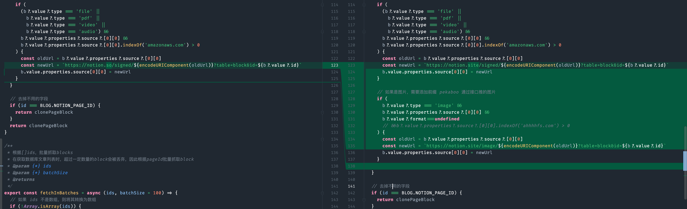
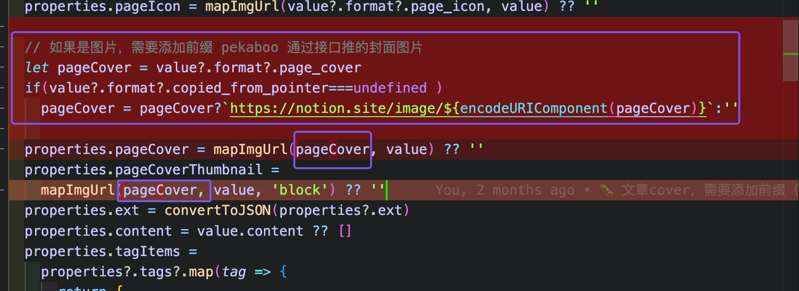

>  getPostBlocks.js
 


```
    // 如果是图片，需要添加前缀 pekaboo 通过接口推的图片
    if (
      b?.value?.type === 'image' &&
      b?.value?.properties?.source?.[0][0] && 
      b?.value?.format===undefined 
      // &&b?.value?.properties?.source?.[0][0].indexOf('ahhhhfs.com') > 0
    ) {
      const oldUrl = b?.value?.properties?.source?.[0][0]
      const newUrl = `https://notion.site/image/${encodeURIComponent(oldUrl)}?table=block&id=${b?.value?.id}`
      b.value.properties.source[0][0] = newUrl
    }
    ```

> getPageProperties.js



``` java
  // 如果是图片，需要添加前缀 pekaboo 通过接口推的封面图片
  let pageCover = value?.format?.page_cover
  if(value?.format?.copied_from_pointer===undefined )
    pageCover = pageCover?`https://notion.site/image/${encodeURIComponent(pageCover)}`:''
```


如果想改变主题颜色  
<!-- bg-indig。。。o   - 》  bg-gree。。。n
<!-- bg-blue。。。e   - 》  bg-gree。。。n

bg-[#4f65f。。。0]   - 》 bg-[#2fc86。。。0]

bg-[#0060e。。。0] bg-[#b7c7b3...3] -->
<!-- 2024-09-05 12:47:30 -->
